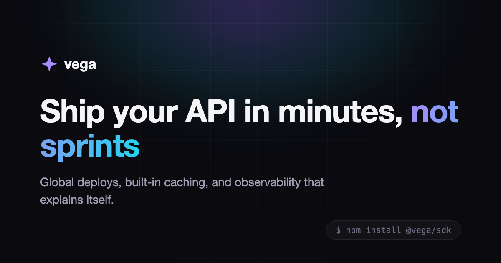

# Pulsar Lite



A free, dark landing-page + blog theme for developer-tool and API companies, built with Astro 6 and Tailwind CSS 4. No UI frameworks, no client-side JavaScript beyond a small nav script and tab control — `.astro` components, self-hosted fonts, fully static output.

**Live demo:** [pulsar-lite.cometthemes.com](https://pulsar-lite.cometthemes.com)

The demo brand is **Aurora Labs**, a fictional API platform. Everything is meant to be rebranded.

## What's included

- Landing page: hero with code panel, logo cloud, bento feature grid (region map, latency sparkline), tabbed code showcase, trace-waterfall observability section, testimonials, CTA
- Blog: index with featured post, fully styled article pages, four example posts
- Mobile nav, 404 page, OG image, sitemap, canonical URLs
- Design-token system: rebrand the palette by editing one `@theme` block
- Accessible: semantic landmarks, focus states, `prefers-reduced-motion` support, WCAG AA contrast

## Quick start

```bash
pnpm install
pnpm dev        # http://localhost:4321
pnpm build      # static output in dist/
```

Requires Node 22.12+.

## Customizing

**Colors and type** live in the `@theme` block of `src/styles/global.css` — surfaces, hairlines, three text levels, and the violet→cyan accent pair. Components only use tokens, so changing the block restyles the whole site. `DESIGN.md` documents the full system.

**Brand strings** to replace: the wordmark in `src/components/Logo.astro`, the default description in `src/layouts/BaseLayout.astro`, the company line in `src/components/Footer.astro`, the `site` URL in `astro.config.mjs`, the author default in `src/content.config.ts`, and page titles in `src/pages/`. Find the rest with `grep -ri aurora src/`.

**Blog posts** are Markdown files in `src/content/blog/` with `title`, `description`, `pubDate`, `author`, optional `authorRole`/`tags`/`draft` frontmatter. Routes derive from the filename.

## Lite vs Pulsar

| | Pulsar Lite (this repo) | [Pulsar — $39](https://buy.cometthemes.com) |
|---|---|---|
| Landing page | ✓ | ✓ |
| Blog | ✓ | ✓ |
| Documentation (Starlight, restyled to match the brand) | — | ✓ |
| Pricing page with comparison table + FAQ | — | ✓ |
| Changelog with timeline layout | — | ✓ |
| Updates | — | Current Astro major + 12 months |
| License | MIT | Commercial, unlimited projects |

The docs are the reason Pulsar exists: a devtool company's documentation usually looks nothing like its marketing site. Pulsar ships Starlight fully restyled to the same design system — one brand across landing, docs, blog, and changelog.

## License

MIT. If this theme is useful to you, a star helps other people find it.
